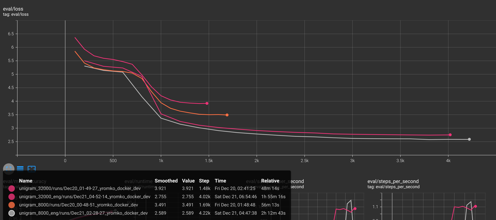
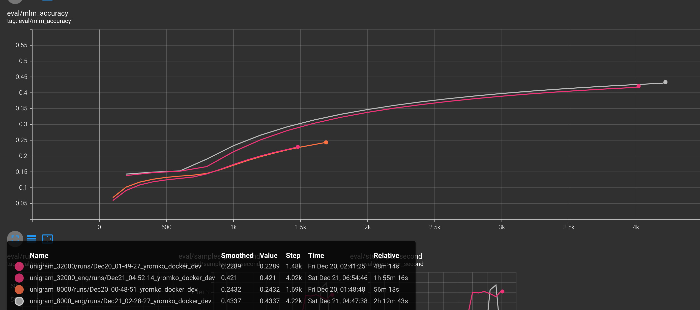
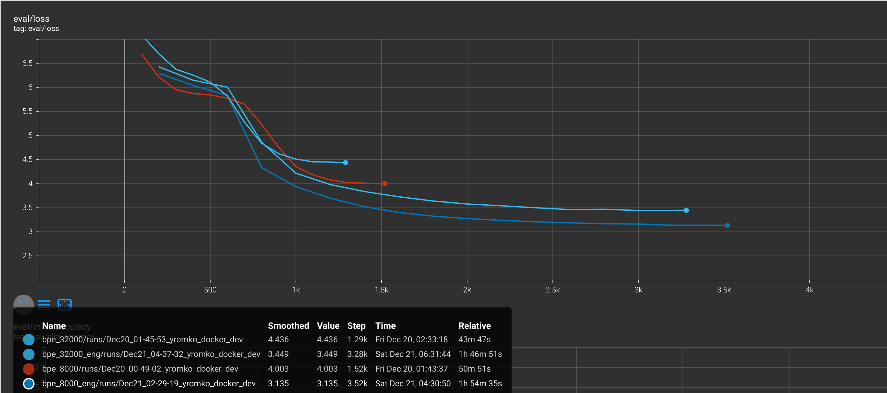
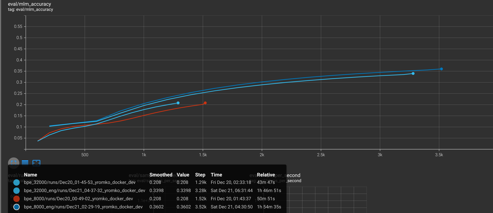
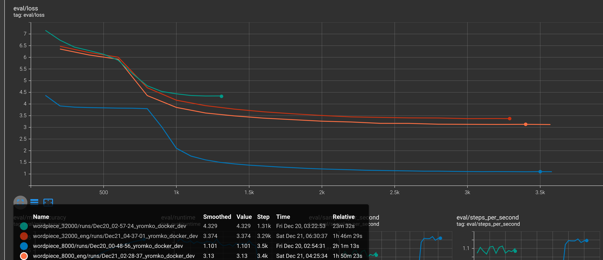
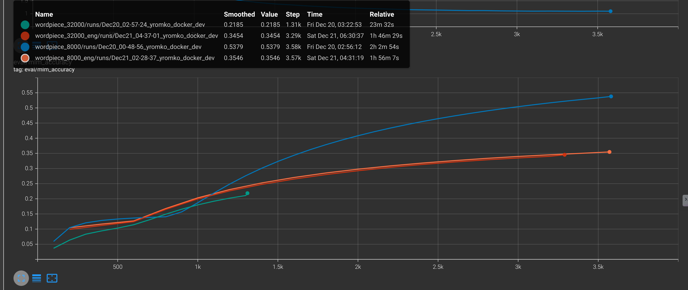

# Эффективность токенизаторов

Кто сделал:
 - Романенко Ярослав (БИВТ-21-16)
 - Тен Дамир (БИВТ-21-16)

## Что сделано 

Обучена модель BERT с различными токенизаторами 
 - BPE
 - Unigram
 - WordPiece 

Размеры словаря
 - 8000
 - 32000

Было два эксперемнта на подвыборке из датасета [Reddit (Title, Body)-Pairs](https://huggingface.co/datasets/sentence-transformers/reddit-title-body)
 - 100k train, 10k test (multilang)
 - 500k train, 20k test с фильтрацией (eng)

Метрики
 - MLM Accuracy

## Цель эксперимента
Найти зависимость итогового качества и сходимости от vocab_size и от типа токенизатора

## Результаты

Файлы для tensorboard лежат в results

### Unigram




Можно сказать, что размер словаря слабо повлиял на точность, метрики очень близки, если брать на одной отметке степа (с маленьким токенизатором будет больше степов, так как количество символов в датасете одинаковое для любого токенизатора, а вместимость токенов разная). Лосс же сходится быстрее на маленьком словаре


### BPE




С лоссами тут ситуация схожая, хотя и в какой-то момент 32k обгоняет 8k, далее 8k начинает сходиться быстрее  
На метриках multilang 32k равен 8k, если брать последние степы на обоих запусках, однако 32k сделал меньше степов за счет большей вместимости токенов. Обучение явно не сошлось до конца, так что при дальнейшем обучении скорее был бы лучше токенизатор с 32k размером словаря. На eng версии датасета 32k чуть хуже, что можно объяснить тем, что для английского может хватать и 8k словаря, при этом 8k сходится быстрее

### WordPiece




Тут токенизатор отработал плохо при 8k словаре на multilang. Вместимость токенов получилась маленькая, почти все токены - это 1-2 символа, что сильно упрощает задачу. Это отражается на лоссе, метриках и количестве степов. На eng же видно, что метрики одинаковые (если брать на равном количестве степов)

# Вывод

На мультиязычных датасетах стоит использовать размер словаря побольше, особенно для WordPiece токенизатора. На моноязычных данных вполне достаточно 8k словаря, при этом сходимость лосса быстрее при таком маленьком словаре


# Запуск 

```bash
bash train_all.sh -c configs/eng_config.json -l eng
```